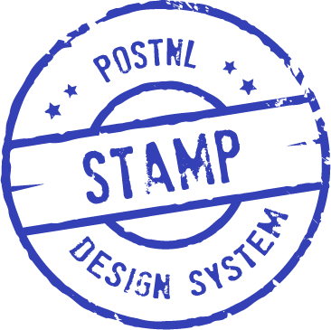

<p align="center">
  <a href="https://google.com/">
    
  </a>
</p>

<h1 align="center">@stamp/react <code style="font-size: 15px;">v1.0</code></h1>

<p align="center">
  Generic React components to use as building blocks for your PostNL UI
  <br>
    <br>
  <a href="Link naar zeroheight?"></a>
  <button class="stamp-button stamp-button--variant-primary">Click dgbrnrtnrtnrtnrtnrt<div class="stamp-icon stamp-icon--size-s"><svg width="24" height="24" viewBox="0 0 24 24" fill="none" xmlns="http://www.w3.org/2000/svg" role="presentation"><path d="M5.67971 5.49041C4.27163 6.77655 3.42788 8.08577 3.0086 10.2719C2.96297 10.836 3.1022 10.8397 3.34876 10.8462C3.37404 10.8469 3.40044 10.8476 3.42788 10.8489C3.62333 10.8489 3.76015 10.8494 3.88726 10.8499C4.11623 10.8508 4.31372 10.8515 4.76571 10.8489C4.97873 10.8314 5.01335 10.6959 5.06377 10.4984C5.07601 10.4505 5.08919 10.3989 5.10607 10.3445C5.14412 10.2219 5.15566 10.1855 5.16948 10.142C5.18705 10.0867 5.2083 10.0198 5.2924 9.74921C5.63645 8.61137 6.28603 7.83006 7.15311 7.03806C9.63699 4.76929 13.8546 5.09553 16.0867 7.57487C16.0867 7.57487 16.7423 8.35485 16.9943 8.73308C16.4142 8.75091 15.6496 8.75441 15.6496 8.75441L12.6287 8.73308C12.5702 8.73249 12.5587 8.86652 12.5611 8.92796C12.5673 9.06792 13.3329 10.2735 13.7274 10.6153C13.9736 10.828 14.289 10.8225 14.6288 10.8165C14.6972 10.8153 14.7665 10.8141 14.8365 10.8146L19.6689 10.8489C20.2057 10.8524 20.6369 10.4585 20.6703 9.93426L20.9627 5.35778C20.9671 5.28938 20.9731 5.2217 20.9791 5.15499C21.0089 4.82336 21.0366 4.51557 20.8371 4.26022C20.5165 3.85088 19.3421 3.01868 19.2 3.00285C19.1381 2.99573 19.0003 2.99816 18.9968 3.05535L18.7193 7.39633L17.5858 6.20567C14.3315 2.78743 8.99053 2.4663 5.67971 5.49041Z" fill="currentColor"></path><path d="M18.3203 18.5096C19.7284 17.2235 20.5721 15.9142 20.9914 13.7281C21.037 13.164 20.8978 13.1603 20.6512 13.1538C20.626 13.1531 20.5996 13.1524 20.5721 13.1511C20.3767 13.1511 20.2399 13.1506 20.1127 13.1501C19.8838 13.1492 19.6863 13.1485 19.2343 13.1511C19.0213 13.1686 18.9867 13.3041 18.9362 13.5016C18.924 13.5495 18.9108 13.6011 18.8939 13.6555C18.8559 13.7782 18.8443 13.8145 18.8305 13.858C18.813 13.9133 18.7917 13.9802 18.7076 14.2508C18.3636 15.3886 17.714 16.1699 16.8469 16.9619C14.363 19.2307 10.1454 18.9045 7.91326 16.4251C7.91326 16.4251 7.25773 15.6452 7.00573 15.2669C7.58577 15.2491 8.35039 15.2456 8.35039 15.2456L11.3713 15.2669C11.4298 15.2675 11.4413 15.1335 11.4389 15.072C11.4327 14.9321 10.6671 13.7265 10.2726 13.3847C10.0264 13.172 9.71102 13.1775 9.37119 13.1835C9.30284 13.1847 9.23349 13.1859 9.16352 13.1854L4.33108 13.1511C3.79431 13.1476 3.36309 13.5415 3.32974 14.0657L3.03727 18.6422C3.03293 18.7106 3.02685 18.7783 3.02086 18.845C2.99106 19.1766 2.9634 19.4844 3.16295 19.7398C3.48352 20.1491 4.65788 20.9813 4.8 20.9971C4.8619 21.0043 4.99971 21.0018 5.00319 20.9447L5.2807 16.6037L6.41425 17.7943C9.66852 21.2126 15.0095 21.5337 18.3203 18.5096Z" fill="currentColor"></path></svg></div></button>
  <br>
  <br>
  <a href="link naar Slack?">Report bug (GitHub)</a>
  ·
  <a href="link naar Slack?">Request feature (GitHub)</a>
</p>

## Table of contents

- [Installation](#installation)
- [Getting Started](#getting-started)
- [Examples](#examples)
- [Documentation](#documentation)
- [Contributing](#contributing)
- [Versioning](#versioning)
- [Copyright and license](#copyright-and-license)


## Installation

Stamp/react is available as an NPM package.

**Install with NPM:**

```bash
npm install @stamp/react
```

**Install with Yarn:**

```bash
yarn add @stamp/react
```

## Getting started
### Components

Here is an example of a basic app using Stamp/react `Button` component:

```jsx

import { Button, ThemeProvider } from '@stamp/react';

function App() {
  return (
  	<ThemeProvider>
  		<Button variant="secondary">Hello World</Button>;
  	</ThemeProvider>
  )
}
```

For more options and other components, read the React documentation.

[](link zero height)


### CSS

CSS is provided through a global stylesheet. An example of it's usage could be to import it in your JS application so styles are applied to the used components:

```js
import '@stamp/react/style.css';
```

To apply global styling, wrap your application in the `ThemeProvider` component:

```js
import { ThemeProvider } from '@stamp/react';
```

### Fonts

The `ThemeProvider` applies the `PostNL` font family to it's wrapping element. That font family needs to be made available to make those styles work. These fonts are located in the package at `dist/fonts`, and in the situation where you can link to assets from npm packages (e.g. webpack), it can be set up like this:

```css
@font-face {
    font-family: PostNL;
    src: url(@stamp/react/fonts/PostNL-Bold-Italic.woff2) format('woff2');
    font-weight: 700;
    font-style: italic;
}

@font-face {
    font-family: PostNL;
    src: url(@stamp/react/fonts/PostNL-Bold.woff2) format('woff2');
    font-weight: 700;
    font-style: normal;
}

@font-face {
    font-family: PostNL;
    src: url(@stamp/react/fonts/PostNL-Medium-Italic.woff2) format('woff2');
    font-weight: 400;
    font-style: italic;
}

@font-face {
    font-family: PostNL;
    src: url(@stamp/react/fonts/PostNL-Medium.woff2) format('woff2');
    font-weight: 400;
    font-style: normal;
}

@font-face {
    font-family: PostNL;
    src: url(@stamp/react/fonts/PostNL-Light-Italic.woff2) format('woff2');
    font-weight: 300;
    font-style: italic;
}

@font-face {
    font-family: PostNL;
    src: url(@stamp/react/fonts/PostNL-Light.woff2) format('woff2');
    font-weight: 300;
    font-style: normal;
}
```

## Examples
Naar zero height verwijzen waar per component voorbeeld staat?

[](link zero height)

## Documentation
Naar zero height verwijzen ?

[](link zero height)

## Tools

### Vite

To distribute this component library, it needs to be bundled properly. [Vite](https://vitejs.dev/) bundles the library into the desired formats: esm & umd. This serves both modern and legacy usages.

To bundle the application using [Vite](https://vitejs.dev/), run the following command:

```bash
npm run build
```

### Storybook

[Storybook](https://storybook.js.org/) is used to preview isolated components

To run it using a development server, run the following command:

```bash
npm run storybook:start
```

To build a static version of it, run the following command:

```bash
npm run storybook:build
```

### Plop

Creating and adjusting files for new components can be painful. We've made this easier for you by using [Plop](https://plopjs.com/). To generate files for a new component, run the following command:

```bash
npm run generate
```

This prompts you to enter the name of the component and goes through the following steps:

-   Scaffolds a component directory containing the following files:
    -   Component file
    -   Barrel file where everything can be exported
    -   Style declarations
    -   Storybook story
-   Updates all barrel files in the package so the component is exported correctly

### Jest

For unit testing [Jest](https://jestjs.io) is used. To execute the tests, run the following command:

```bash
npm run test
```

## Contributing
### Help improve Stamp!
**Bug** <br>
If you find a bug, please let us know via the [... GitHub]()

**Feature request** <br>
If want to request a new feature, please let us know via the [... GitHub]()

## Versioning
?

<style>
	.stamp-button, a.stamp-button {
	    display: inline-flex;
	    gap: 8px;
	    align-items: center;
	    justify-content: center;
	    max-inline-size: 100%;
	    inline-size: auto;
	    cursor: pointer;
	    padding-block: 8px;
	    padding-inline: 24px;
	    border-style: solid;
	    border-width: 1px;
	    font-family: PostNL;
	    font-weight: 500;
	    line-height: 1.5;
	    font-size: 16px;
	    -webkit-text-decoration: none;
	    text-decoration: none;
	}
	
	.stamp-button:hover {
	    -webkit-text-decoration: underline;
	    text-decoration: underline;
	}
	
	.stamp-button--variant-primary, a.stamp-button--variant-primary {
	    background-color: #3440b6;
	    border-color: #ffffff00;
	    border-radius: 24px;
	    color: #ffffff
	}
	
	.stamp-icon--size-s {
	    inline-size: 16px;
	    block-size: 16px;
	}
	
	.stamp-icon {
	    display: flex;
	}
</style>
